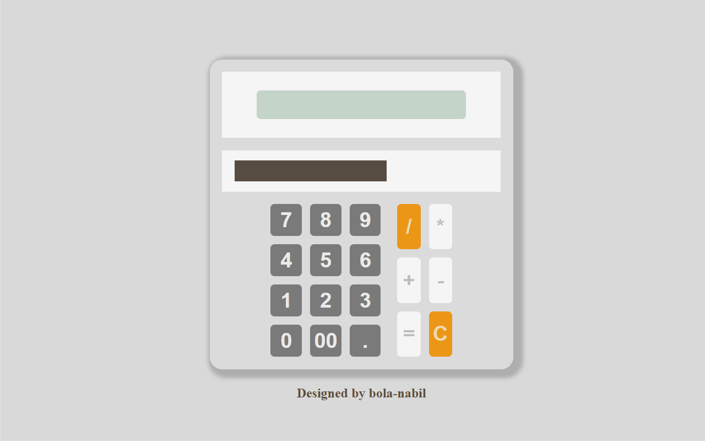

#  🧮 Calculator Using React [Live Demo](https://bola-nabil.github.io/calculator-react/)

## 📖 Description
This project is a **simple calculator application** built with **React**.
It provides all the basic arithmetic operations — addition, subtraction, multiplication, and division — with a clean and responsive UI.

The calculator is designed to mimic the look and feel of a standard digital calculator while demonstrating **state management and component-based design in React**.

----
## 📸 Preview


---
## ✨ Features
- **Addition, Subtraction, Multiplication, Division**
- **Clear & Reset** functionality
- **Responsive UI** for desktop and mobile
- **Fast and lightweight** — built entirely with React
- **Reusable Components**

---
## 🛠️ Tech Stack
- **React** – Frontend framework
- **CSS**

---
## 🚀 Getting Started
1. Clone the repo:
```
git clone https://github.com/bola-nabil/calculator-react.git
```
2. Install dependencies:
```
npm install
```
3. Run the app:
```
npm start
```

